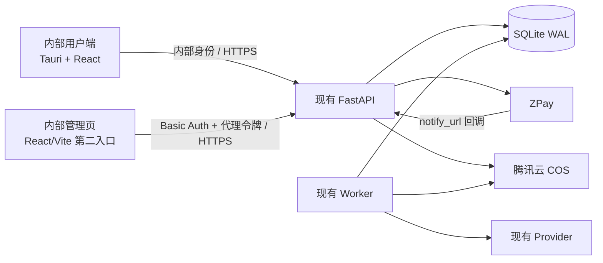

# 内部运营与 ZPay 计费管理文档（P0）

> 版本：P0.1
>
> 文档日期：2026-08-19
>
> 状态：当前唯一 P0 实施正本
>
> 使用对象：公司内部账号，不对外开放客户注册与售卖
>
> 开发清单：`docs/内部运营P0开发任务清单.md`
>
> 后续完整蓝图：`docs/激活码管控与云端计费管理文档-V1.4.md`

---

## 0. 最终决策

P0 只解决一条最小业务闭环：

```text
内部账号充值
→ ZPay 支付
→ 回调验签入账
→ 生成视频时冻结 1 条
→ 交付成功扣除，失败自动返还
```

P0 默认规则：

| 项目 | P0 规则 |
| --- | --- |
| 使用范围 | 仅公司内部账号 |
| 内部基础价 | 10 元/条，即 1000 分/条 |
| P0 实际收费价 | 10 元/条，与内部基础价相同 |
| 最低充值 | 100 元，即 10000 分 |
| 充值步长 | 10 元，即 1000 分 |
| 可选金额 | 100、110、120…… |
| 余额单位 | 整数条数，1 条可生成 1 个最终视频 |
| 支付渠道 | ZPay；P0 只启用支付宝/微信中后台已开通的渠道 |
| 管理角色 | 仅 1 种 `admin` |
| 部署方式 | 单台云服务器、单 API 实例、现有 Worker |

服务端校验公式：

```text
amount_fen >= min_recharge_fen_snapshot
amount_fen % recharge_step_fen_snapshot == 0
amount_fen % charged_unit_price_fen_snapshot == 0
credits = amount_fen / charged_unit_price_fen_snapshot
```

P0 不接受 99 元、101 元、100.5 元等金额，客户端和服务端都要校验，以服务端结果为准。

---

## 1. 范围和非目标

### 1.1 P0 必须完成

- 内部账号由管理员创建或启用，不开放公众自助注册。
- 内部用户可以查看余额、充值、查看充值订单和条数流水。
- 管理员可以配置 ZPay、内部基础价、最低充值和充值步长。
- ZPay 支付成功后自动增加条数。
- 每次视频生成冻结 1 条；可下载成片进入 COS 后结算，失败或取消后返还。
- 支付订单、余额变化和任务扣费均可追溯且不能重复执行。
- 用户端和管理端界面分离，但继续共用同一个 FastAPI 后端。

### 1.2 P0 明确不做

- 不开放外部客户注册、购买、激活和多设备管理。
- 不实现客户等级价、渠道价、折扣、优惠券、分佣和订阅。
- 不实现自动现金退款、开票和税务处理。
- 不实现复杂套餐、免费配额、运营报表和 `auditor` 角色。
- 不引入 React-admin、Redis、Celery、Temporal、Kafka 或完整计费平台。
- 不迁移 PostgreSQL，不做多实例和高可用承诺。
- 不引入 Supercronic；P0 使用管理端手动查单和手动对账入口。

内部 P0 的功能不能被宣传为已具备对外客户运营能力。

---

## 2. 双层价格模型

### 2.1 为什么现在就区分两层价格

当前 10 元是内部基础价。未来面向客户时，还需要在其上增加销售加价，因此不能把 10 元永久命名为“客户售价”。

系统统一使用以下两个概念：

| 概念 | 含义 | P0 |
| --- | --- | --- |
| `base_unit_price_fen` | 内部基础价，用于内部结算和后续利润参考 | 1000 |
| `charged_unit_price_fen` | 本次充值实际按多少元换 1 条 | 1000 |

P0 中两者相等：

```text
内部基础价 10 元 + P0 加价 0 元 = 实际收费价 10 元
```

未来客户版可以变成：

```text
内部基础价 10 元 + 客户/渠道加价 = 客户实际销售价
```

### 2.2 订单必须保存价格快照

每个充值订单必须保存：

- `pricing_scope`：P0 固定为 `INTERNAL`；
- `base_unit_price_fen_snapshot`；
- `charged_unit_price_fen_snapshot`；
- `min_recharge_fen_snapshot`；
- `recharge_step_fen_snapshot`；
- `amount_fen`；
- `credits`。

价格调整只影响新建充值订单，历史订单和已经到账的条数不重新计算。

### 2.3 客户版扩展边界

客户版再新增价格规则或价格方案，例如：

- `CUSTOMER_STANDARD`；
- `CHANNEL_A`；
- 指定客户价格；
- 固定加价或固定销售价。

P0 不创建价格方案表，也不实现价格规则引擎。未来只需在创建订单时解析销售价，并把结果写入现有价格快照字段，不改变钱包和任务扣费模型。

P0 设置页只编辑一个“内部基础价”，实际收费价由服务端强制取同一个值。保存设置时必须满足：价格大于 0、最低充值不低于 100 元、充值步长能被单价整除、最低充值能被充值步长整除。默认配置仍固定为 10 元/条、100 元起充和 10 元步长。

---

## 3. 最小系统结构



### 3.1 组件决策

| 能力 | P0 决策 |
| --- | --- |
| 后端 | 继续使用现有 FastAPI，不拆支付微服务 |
| 用户端 | 在现有客户端增加余额、充值和订单状态 |
| 管理端 | 复用现有 React/Vite，增加独立 `/admin` 构建入口；不引入 React-admin |
| 数据库 | 继续使用 SQLite，开启 WAL 和 `busy_timeout` |
| Worker | 继续使用现有 Worker，不增加新队列 |
| 存储 | 云端输入、人物资产和成片继续进入 COS |
| HTTPS | 使用现有反向代理或 Caddy，保证 ZPay 能访问公开回调地址 |
| 周期任务 | P0 不启动 scheduler；查单和对账由管理端按钮或 CLI 触发 |

### 3.2 内部身份边界

P0 不把当前开发身份头直接暴露到云端：

- 内部账号继续复用现有 `users`；
- 账号由管理员通过受控 CLI 创建，不开放注册页；
- CLI 为内部账号签发高熵随机访问令牌，数据库只保存令牌摘要；
- Tauri 客户端把令牌保存到系统安全存储，并通过 Bearer Token 访问业务 API；
- 云端必须关闭 `X-Dev-User-Id` 和固定 `VIDEO_REPLICA_DESKTOP_USER_ID` 身份旁路；
- 令牌可以由管理员 CLI 撤销，撤销后立即失效。

内部管理页不在 P0 自建账号系统。它由反向代理的内网/VPN、IP 允许列表和部署级 Basic Auth 共同保护；FastAPI 端口不直接暴露公网。反向代理在验证 Basic Auth 后，移除外部请求伪造的管理头，再注入一个高熵 `X-Control-Proxy-Token`。FastAPI 只保存该令牌的 SHA-256 摘要，恒定时间校验通过后，才把操作记录为预创建的 `internal-admin` 审计身份。ZPay 回调路径单独公开，不受管理页 Basic Auth 影响。

### 3.3 SQLite 的使用限制

P0 只允许：

- 一台云服务器；
- 一个 API 实例；
- SQLite 文件位于服务器本地持久盘，不放在网络文件系统；
- API 与 Worker 的写事务保持短小；
- 支付入账、冻结、结算和返还使用显式事务和唯一约束。

需要第二台服务器、多个 API 实例或公开客户流量时，必须先迁移 PostgreSQL，不能继续扩展这一限制条件下的 SQLite 部署。

---

## 4. ZPay 最小接入

### 4.1 采用页面跳转支付

P0 使用 ZPay 的页面跳转支付，不接 `mapi.php` 二维码 API，不增加 Node 服务或第三方支付 SDK。

服务端生成签名参数，用户端通过表单 POST 跳转支付页面。签名逻辑由 Python 标准库实现并单元测试。

当前公开文档地址：[ZPay 开发文档](https://api.z-pay.cn/doc.html)。官方文档要求：

- 参数按名称 ASCII 升序排列；
- `sign`、`sign_type` 和空值不参与签名；
- 拼接值不先做 URL 编码；
- 拼接商户密钥后计算小写 MD5；
- 回调必须验签、核对金额并处理重复通知；
- 正确处理后返回纯文本 `success`。

`notify_url` 和 `return_url` 从公开基础域名派生，均不附带查询参数。商品名称使用能够说明用途的固定文案，例如“内部视频生成条数充值 10 条”。

用户提供的 Node Demo 只作为签名参考。Demo 中的网关域名和参数与当前公开文档存在差异，部署时以商户后台“API 信息”显示的实际地址为准。

### 4.2 创建充值订单

服务端收到充值请求后：

1. 校验内部用户身份；
2. 请求体只接受 `amount_fen: integer`；前端显示元，但提交分；
3. 校验最低 100 元、符合充值步长并能被本单实际收费价整除；
4. 从服务端设置读取当前内部基础价；
5. P0 将实际收费价设置为同一个值；
6. 计算到账条数；
7. 创建本地 `PENDING` 订单；
8. 生成不超过 32 位、仅含数字且全局唯一的 ZPay 商户订单号；
9. 返回已签名的支付表单参数。

前端不得提交或覆盖 `credits`、价格快照、商户号、回调地址或签名。

### 4.3 异步回调

`notify_url` 是唯一自动入账入口。回调处理顺序固定为：

1. 验证签名；
2. 验证 `pid` 等于本系统商户号；
3. 验证 `trade_status = TRADE_SUCCESS`；
4. 按 `out_trade_no` 查询本地订单；
5. 将回调 `money` 转为整数分并与 `amount_fen` 完全比较；
6. 校验 ZPay `trade_no` 没有绑定到其他订单；
7. 在同一事务内锁定订单和钱包；
8. 把订单从 `PENDING` 改为 `PAID`；
9. 插入一条 `CHARGE` 流水并增加条数；
10. 提交后在 5 秒内返回 `success`。

同一订单的重复回调必须直接返回 `success`，不能再次增加条数。已支付订单如果出现不同金额、不同商户号或不同 ZPay 订单号，应记录错误并拒绝改账。

回调事务必须极短：签名和字段校验完成后，只执行订单、流水和钱包写入；不得在事务中查 ZPay、访问 COS/Provider 或写入大对象。支付回调连接使用短于 ZPay 5 秒应答窗口的数据库等待预算；如果 SQLite 写锁未及时取得，不返回 `success`，由 ZPay 按官方策略重试。

### 4.4 页面返回和主动查单

`return_url` 只显示“正在确认支付”，不能直接入账。用户端继续查询本地订单状态。

管理员可以对仍为 `PENDING` 的订单执行“同步 ZPay 状态”。主动查单返回支付成功时，仍调用与异步回调相同的入账函数，不能另写一套逻辑。

P0 不实现自动 ZPay 现金退款。钱包的 `RELEASE` 只是生成任务失败后的条数返还，不是支付退款。

---

## 5. 余额和按条计费

### 5.1 钱包

每个内部用户只有一个钱包：

- `available_credits`：可创建新任务的条数；
- `reserved_credits`：已经被运行中任务冻结的条数。

两个字段均为非负整数。

### 5.2 流水类型

P0 只实现四种流水：

| 类型 | 可用条数变化 | 冻结条数变化 | 触发点 |
| --- | ---: | ---: | --- |
| `CHARGE` | `+n` | `0` | ZPay 订单确认支付 |
| `RESERVE` | `-1` | `+1` | 创建一条视频生成任务 |
| `SETTLE` | `0` | `-1` | 成片已进入 COS 且可下载 |
| `RELEASE` | `+1` | `-1` | 任务失败或取消 |

P0 不实现 `REFUND`、`ADJUST`、赠送条数和免费配额。

### 5.3 任务事务

创建任务时，在同一数据库事务内：

1. 锁定钱包写入；
2. 校验 `available_credits >= 1`；
3. 创建任务；
4. 插入唯一 `RESERVE`；
5. 更新钱包。

任务成功、失败或取消时统一调用一个终结函数：

```text
finalize_internal_billing(task_id, outcome)
```

- `success` 写 `SETTLE`；
- `failed/cancelled` 写 `RELEASE`；
- 已有终态时原样返回，禁止重复扣除或返还；
- Provider 成功但成片尚未进入 COS 时不能 `SETTLE`。

付费重生成立新任务或新计费轮次，再冻结 1 条。现有请求中的 `payment_confirmed=true` 不是支付凭证，不能绕过钱包校验。

---

## 6. 最小数据模型

P0 复用现有 `users`、任务、设置和审计能力，只新增或调整以下数据。

### 6.1 `internal_access_tokens`

- `id`；
- `user_id`；
- `token_digest UNIQUE`；
- `created_at`；
- `revoked_at`。

只在签发时向内部人员显示一次原始令牌；数据库、日志和管理页面均不得回显。

### 6.2 `wallets`

- `user_id UNIQUE`；
- `available_credits`；
- `reserved_credits`；
- `updated_at`。

### 6.3 `wallet_transactions`

- `id`；
- `user_id`；
- `type`；
- `available_delta`；
- `reserved_delta`；
- `recharge_order_id`；
- `task_id`；
- `billing_round`；
- `idempotency_key UNIQUE`；
- `created_at`。

约束：

- 一个充值订单最多一条 `CHARGE`；
- 一个任务计费轮次恰好一个 `RESERVE`；
- 一个任务计费轮次最多一个终态，`SETTLE` 和 `RELEASE` 不能同时存在；
- 流水禁止通过业务 API 修改或删除。

### 6.4 `recharge_orders`

- `id`；
- `user_id`；
- `merchant_order_no UNIQUE`；
- `provider = 'zpay'`；
- `provider_trade_no UNIQUE NULLABLE`；
- `channel`；
- `status = PENDING | PAID | CLOSED | FAILED`；
- `pricing_scope = 'INTERNAL'`；
- `base_unit_price_fen_snapshot`；
- `charged_unit_price_fen_snapshot`；
- `min_recharge_fen_snapshot`；
- `recharge_step_fen_snapshot`；
- `amount_fen`；
- `credits`；
- `notify_digest`；
- `created_at`；
- `paid_at`。

未支付订单的 `provider_trade_no` 必须为数据库 `NULL`，不得写空字符串。不保存 ZPay 密钥、完整未脱敏回调正文或前端传入的计算结果。

### 6.5 设置复用

继续复用现有 `SettingsRepository`，不新建配置平台。新增设置：

- `billing.internal_base_unit_price_fen = 1000`；
- `billing.min_recharge_fen = 10000`；
- `billing.recharge_step_fen = 1000`；
- `zpay.pid`；
- `zpay.key`；
- `zpay.enabled_channels`。

`zpay.key` 使用现有加密能力保存，API 永不返回明文。

以下只允许通过环境变量或部署文件配置：

- `PUBLIC_BASE_URL`；
- ZPay 网关基础地址；
- 数据库路径；
- 主加密密钥；
- 仅配置在反向代理的原始 `CONTROL_PROXY_TOKEN`；
- 仅配置在 API 的 `CONTROL_PROXY_TOKEN_DIGEST` 与 `CONTROL_ADMIN_USER_ID`；
- TLS 与 CORS。

回调和返回地址从 `PUBLIC_BASE_URL` 派生，不允许管理员输入任意 URL。

---

## 7. 最小 API

### 7.1 内部用户接口

| 接口 | 用途 |
| --- | --- |
| `GET /api/wallet` | 查看可用/冻结条数 |
| `GET /api/wallet/transactions` | 查看分页流水 |
| `POST /api/recharge-orders` | 创建 ZPay 充值订单 |
| `GET /api/recharge-orders/{order_no}` | 查询本人的充值状态 |

### 7.2 ZPay 接口

| 接口 | 用途 |
| --- | --- |
| `GET /api/payments/zpay/notify` | 异步通知、验签和入账 |
| `GET /api/payments/zpay/return` | 返回内部客户端的展示页，不入账 |

### 7.3 管理接口

| 接口 | 用途 |
| --- | --- |
| `GET /api/control/settings` | 读取内部价格、ZPay 掩码配置和部署派生 URL |
| `PATCH /api/control/settings/billing` | 内部价格与充值规则 |
| `PATCH /api/control/settings/zpay` | ZPay 配置；密钥只覆盖更新 |
| `GET /api/control/accounts` | 内部账号、可用/冻结条数和令牌数量 |
| `GET /api/control/recharge-orders` | 订单查询和过滤 |
| `POST /api/control/recharge-orders/{order_no}/sync` | 主动查单补偿 |
| `GET /api/control/wallet-transactions` | 只读账务流水 |
| `GET /api/control/billing-reconciliation` | 只读对账结果 |
| `GET /api/control/recharge-orders.csv` | 导出充值订单 CSV |
| `GET /api/control/wallet-transactions.csv` | 导出账务流水 CSV |

P0 不提供手工改余额接口。需要修复数据时先通过只读对账确认原因，再走受控 CLI 和完整记录，避免后台随意改账。

---

## 8. 最小界面

### 8.1 内部用户端

在现有客户端增加一个“余额与充值”入口：

- 显示内部价 `10 元/条`；
- 显示可用条数和冻结条数；
- 提供 100、200、500、1000 元快捷按钮；
- 提供自定义整数金额，限制为 100 元起、10 元步长；
- 选择已开通的支付宝或微信渠道；
- 跳转 ZPay；
- 返回后轮询支付状态；
- 展示充值和条数流水。

### 8.2 内部管理页

管理端只做三个页面：

1. 内部账号与钱包；
2. ZPay 充值订单与手动同步；
3. ZPay 和内部价格设置。

管理入口由反向代理保护，不做应用内登录页。也不做总览大屏、套餐、设备、报表、审计中心和管理员管理页。必要审计仍由后端记录，P0 只通过日志或数据库查询查看。

反向代理样例见 `deploy/nginx/internal-p0.conf.example`。部署时必须替换域名、证书、Basic Auth 文件和高熵 `X-Control-Proxy-Token` 原文，并在 FastAPI 环境中只保存该令牌的 SHA-256 摘要。

---

## 9. 安全和异常边界

- ZPay 密钥只存在服务端，不进入用户端、管理端响应或日志。
- MD5 是 ZPay 协议要求，只用于该协议签名；签名比较使用恒定时间比较函数。
- 所有金额按整数分计算和保存，禁止使用浮点数。
- 回调必须同时验证签名、商户号、订单号、金额和支付状态。
- `return_url`、前端截图和用户口述都不是到账凭证。
- ZPay 超时或未知状态时保持 `PENDING`，不得猜测成功。
- 外部查单必须有超时和脱敏日志；请求 URL 不记录商户密钥。
- 支付入账、钱包冻结和任务终结必须有数据库唯一约束，不只依赖应用层判断。
- P0 只允许内部受控网络或明确授权的内部账号访问业务端。
- 云端禁止开发身份头和固定桌面用户旁路；内部令牌只保存摘要并支持撤销。
- `/api/control/*` 只能经受保护的反向代理进入，应用服务端口不得绕过代理暴露。
- 外部请求自带的 `X-Control-Proxy-Token` 必须由代理移除；只有代理验证 Basic Auth 后才能注入管理令牌。
- 未完成真实 ZPay 小额链路验收前，只能标记为“代码与自动化通过”。

---

## 10. P0 验收标准

### 10.1 自动化验收

- API 传入 10000、11000、20000 分时订单创建成功；9900、10100 和非整数分被拒绝。用户界面仍显示 100、110、200 元。
- 前端伪造 `credits` 或价格无效，服务端按设置重新计算。
- 已创建订单保存两个价格快照，P0 中均为 1000 分。
- 正确签名和金额的回调只入账一次。
- 重复回调并发执行仍只产生一条 `CHARGE`。
- 错误签名、错误商户号、错误金额和非成功状态均不入账。
- `return_url` 被直接访问不会改变余额。
- 主动查单和异步回调共用同一个入账函数。
- 并发创建任务不能让可用条数小于 0。
- 成功任务只产生 `SETTLE`，失败/取消只产生 `RELEASE`。
- 价格调整不改变历史订单快照和已到账条数。
- 管理 API 和内部用户 API 不能互相冒用身份。
- 伪造、撤销或已失效的内部访问令牌均不能访问业务 API。
- 缺失或伪造代理令牌的控制请求被拒绝，外部请求不能自行注入管理身份。
- 密钥相关响应、日志和 Git 差异中没有明文密钥。

### 10.2 真实链路验收

真实 ZPay 验收必须由授权人员使用测试商户或实际最低充值订单完成，不能由自动化测试擅自发起真实付款。

至少保存：

- 商户订单号和脱敏 ZPay 订单号；
- 支付发起时间、回调时间和入账时间；
- 订单金额、到账条数和价格快照；
- 重复通知或主动查单结果；
- 用户端余额变化截图；
- 不包含商户密钥的服务端日志。

本地 Fake 回调通过不能替代真实 ZPay 验收。

---

## 11. 后续客户版

只有在明确对外销售后，才进入客户版开发：

- 客户注册、企业/渠道归属、激活码和多设备；
- 客户销售价、渠道价、客户特价和价格版本发布；
- 销售价与内部基础价的毛利分析；
- 优惠券、赠送、自动退款、开票和税务；
- PostgreSQL、多实例、共享限流和周期对账；
- `admin/auditor/operator` 等权限；
- 报表、审计中心、告警和备份恢复演练；
- 对外服务协议、隐私政策和支付说明。

客户版创建订单时解析实际销售价，并写入现有 `charged_unit_price_fen_snapshot`。钱包仍按整数条数运行，因此不会推翻 P0 的充值订单、钱包和任务结算结构。

---

## 12. 实施结论

P0 的实现依据只有本文件和 `docs/内部运营P0开发任务清单.md`。

`docs/激活码管控与云端计费管理文档-V1.4.md` 保留为后续客户版完整蓝图，其中 PostgreSQL、React-admin、Supercronic、完整角色和报表等内容不进入当前 P0。

P0 完成的定义是：内部账号能完成一次真实 ZPay 充值、余额只增加一次、视频生成按条冻结并正确结算或返还。除此之外的运营功能均不应阻塞 P0 上线。
