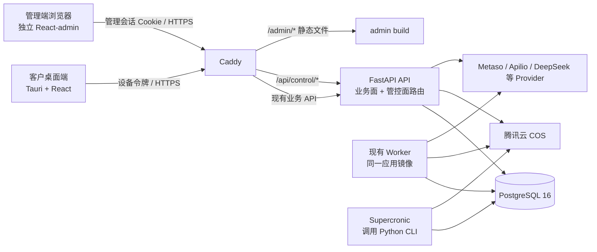

# 激活码管控与云端计费管理文档（V1.4，后续客户版蓝图）

> 状态：`SUPERSEDED_BY_CUSTOMER_V3`。本文件包含套餐/旧设备口径，只能作为历史背景。现行开发入口：`docs/完整客户版V3开发交付索引.md`。

> 文档日期：2026-08-19
>
> 原始定位：后续客户版完整蓝图，不是当前 P0 实施依据
>
> 替代：`docs/激活码管控与云端计费架构方案.md` V1.3 及其以前版本
>
> 当前 P0 正本：`docs/内部运营与ZPay计费管理文档-P0.md`
>
> 后续下游清单：`docs/短视频复刻云化改造-V1开发任务清单.md`
>
> 目标：内部 P0 验证通过并准备对外销售后，把系统扩展为“瘦客户端 + 云端执行 + 独立管理端 + 激活码管控 + 客户销售价 + 按条计费”的完整运营系统

> 当前决议：2026-08-19 起先实施内部 P0。P0 使用 ZPay、固定内部基础价和极简管理页；本文件中的 PostgreSQL、React-admin、Supercronic、完整角色、报表和客户运营能力均延期。

---

## 0. 最终结论

### 0.1 可以做可视化管理端，而且应当做

系统上传到云端后，可以提供独立的 Web 管理端，对 Provider、套餐、激活码、设备、充值、扣费返还、免费配额、并发参数、审计和报表进行可视化配置。

但管理端不能成为“任意修改系统内部常量”的万能配置器。配置必须分成三类：

1. **运营可配置**：套餐、激活码、设备、充值、扣费返还、免费配额、业务并发上限。
2. **管理员可配置**：Provider 密钥、连接参数、任务租约、告警阈值；所有变更必须审计。
3. **只能由运维通过环境变量或部署文件配置**：数据库连接、主加密密钥、TLS、Cookie 域、CORS、对象存储强制策略。

### 0.2 V1 最简组合

| 能力 | V1 决策 |
| --- | --- |
| 管理端前端 | 新建独立 `admin/` React 应用，采用 React-admin；复用现有 `SettingsPanel` 的字段定义与交互逻辑，不把管理页面继续塞进客户客户端 |
| 管控后端 | 继续使用同一个 FastAPI 应用，以 `/api/control/*` 路由和独立鉴权依赖隔离；不拆微服务 |
| 云端数据库 | PostgreSQL 16 + Psycopg 3；保留 Alembic；不引入 ORM 重写 |
| 管理员密码 | `pwdlib[argon2]` |
| 管理员会话 | 服务端保存的随机不透明会话，HttpOnly Cookie；不引入 JWT/IAM 平台 |
| Provider 密钥 | 复用现有 `SettingsRepository` 和 `cryptography`，升级为 MultiFernet 多密钥轮换 |
| 云端存储 | 复用现有腾讯云 COS SDK 与 `StorageAdapter`；云端成片也必须进入 COS |
| 账务 | 项目内自建 PostgreSQL 追加式账本；不接完整 billing 平台 |
| 授权 | 项目内自建设备激活与可撤销随机令牌；V1 不实现设备私钥签名 |
| 周期任务 | Supercronic 容器调用现有 Python CLI；不在 API 进程内跑调度器 |
| 队列 | 复用现有数据库租约 Worker；不引入 Celery、Redis、Temporal |
| RBAC | V1 只有 `admin` 与只读 `auditor`；不引入策略引擎 |

### 0.3 明确不做

- 不自建完整支付平台；沿用内部 P0 已验证的 ZPay 订单、回调和查单能力。自动开票、订阅按比例结算和复杂支付退款仍不做。
- 不接 Keygen、Lago、OpenMeter、Casdoor 等完整平台。
- 不引入 Redis、Celery、Temporal、Kafka。
- 不把后端整体重写为 SQLAlchemy。
- 不新增重复的 `owner_license_id` 租户字段。
- 不把 `estimated_cost` 或 `actual_cost` 当作扣费真源。
- 不把“本地测试通过”描述成“真实 Provider、云服务器或签名安装包已验收”。

---

## 1. 当前代码事实与 V1.4 约束

以下结论来自 2026-08-19 对当前检出代码的核对，不是对旧文档的推测。

| 当前事实 | 证据位置 | V1.4 处理 |
| --- | --- | --- |
| 已有 Provider 与运行参数持久化 | `server/app/settings.py` | 复用，不另建一套配置中心 |
| 已有管理设置 API 雏形 | `server/app/settings_routes.py`，当前前缀为 `/api/admin/settings` | 移挂到 `/api/control/settings`，换成管理会话鉴权 |
| 已有设置表单雏形 | `client/src/SettingsPanel.tsx` | 提取字段 schema 和测试逻辑给独立管理端；客户客户端只保留只读运行状态 |
| 已有 Alembic | `server/migrations/`、`server/pyproject.toml` | 继续使用 |
| 后端仍与 `sqlite3` 深度耦合 | `server/app` 中多处 `sqlite3.Connection`、`?` 占位符、`BEGIN IMMEDIATE` | PG 迁移是一次真实的应用层改造，不能只改连接串 |
| `estimated_cost` 与 `actual_cost` 均已存在 | `server/migrations/versions/001_core.py` | 两者仅保留为成本/展示数据，均不是整数条数账本 |
| 人物身份已存在 `owner_user_id` | `server/migrations/versions/012_character_domain.py` | 复用现有归属，补访问检查与公共模板标记，不新增重复归属列 |
| 人物身份列表当前对 admin/auditor 未做 owner_user_id 过滤；employee 仅做可用性过滤 | `server/app/character_identity.py::list_person_identities` | 必须按当前用户和归属关系统一过滤 |
| 当前管理员/员工身份来自环境变量或开发请求头 | `server/app/auth.py` | 云端替换为设备鉴权与管理会话两套依赖 |
| 成片归档被明确固定到本地盘 | `generation_worker.py`、`generation_routes.py`、`media_routes.py` | 云端模式强制 COS；本地结果存储仅允许开发环境 |
| 成功状态存在多个写入路径 | `server/app/generation.py` | 计费终结不能只挂到 `_store_and_finalize_archive()` |
| 已有 COS SDK、Fernet、存储适配层 | `server/pyproject.toml`、`settings.py`、`storage.py` | 原样复用并修正云端策略 |

由此得出三个不可绕过的前置条件：

1. PostgreSQL 改造完成前，不能声称支持多实例云端并发。
2. 租户隔离完成前，不能开放多客户激活。
3. 所有任务终态都接入统一账务终结器前，不能开启真实扣费。

---

## 2. 开源仓库调研与复用决策

### 2.1 直接采用或继续保留

| 仓库 | 许可证 | 复用范围 | 采用理由 |
| --- | --- | --- | --- |
| [marmelab/react-admin](https://github.com/marmelab/react-admin) | MIT | 管理端路由、列表、筛选、分页、表单、权限壳与自定义 Data Provider | 管理端以 CRUD 为主，能显著减少重复页面代码；可对接自定义 REST API |
| [psycopg/psycopg](https://github.com/psycopg/psycopg) | LGPL-3.0 | PostgreSQL 驱动、连接池、事务 | 直接承接现有 DB-API 风格，改造面小于 ORM 重写 |
| [frankie567/pwdlib](https://github.com/frankie567/pwdlib) | MIT | 管理员 Argon2 密码哈希与校验 | 功能单一、边界清楚 |
| [sqlalchemy/alembic](https://github.com/sqlalchemy/alembic) | MIT | PostgreSQL schema 迁移 | 项目已经使用，继续保留 |
| [tencentyun/cos-python-sdk-v5](https://github.com/tencentyun/cos-python-sdk-v5) | MIT | 素材、成片、诊断对象上传下载 | 项目已经使用，避免换存储 SDK |
| [pyca/cryptography](https://github.com/pyca/cryptography) | Apache-2.0/BSD | Provider 配置加密、MultiFernet 轮换 | 项目已经使用 |
| [aptible/supercronic](https://github.com/aptible/supercronic) | MIT | 容器内周期调用对账、TTL、报表和备份检查 CLI | 独立于 API 进程，避免多 Worker 重复调度 |

### 2.2 只参考，不作为 V1 依赖

| 仓库 | 结论 | 原因 |
| --- | --- | --- |
| [fastapi-users/fastapi-users](https://github.com/fastapi-users/fastapi-users) | 参考 Cookie、数据库会话实现 | 官方已明确进入 maintenance mode，现有系统有“设备用户/管理用户”双鉴权域，直接接入仍需大量定制 |
| [smithyhq/sqladmin](https://github.com/smithyhq/sqladmin) | 参考后台交互 | 核心前提是 SQLAlchemy 模型，与当前 raw SQL 路线不匹配 |
| [refinedev/refine](https://github.com/refinedev/refine) | 备选前端框架 | 与 React-admin 功能重叠；V1 只选一套 |
| [casbin/pycasbin](https://github.com/casbin/pycasbin) | 未来复杂 RBAC 再评估 | V1 仅两个管理角色，引入策略引擎收益不足 |
| [agronholm/apscheduler](https://github.com/agronholm/apscheduler) | 不在 API 进程内采用 | 多实例 API 容易重复启动作业；外置 Supercronic 更简单 |
| [keygen-sh/keygen-api](https://github.com/keygen-sh/keygen-api) | 参考 license/device 模型 | 完整 Rails 服务且采用 Fair Core/source-available 路线，集成成本和许可边界不适合本项目 V1 |
| [getlago/lago](https://github.com/getlago/lago) | 参考不可变流水与幂等设计 | AGPL 且是完整计费平台；本项目只有“整数条数 + ZPay 充值” |
| [openmeterio/openmeter](https://github.com/openmeterio/openmeter) | 参考计量与限流思路 | PostgreSQL + ClickHouse + Kafka，面向高吞吐计量平台，过重 |
| [keycloak/keycloak](https://github.com/keycloak/keycloak) | 不采用 | 完整 IAM 平台，当前只需要管理端会话与设备令牌，运维成本过高 |

### 2.3 复用边界

开源组件只替代通用能力：

- 页面壳、表格、表单和分页；
- PostgreSQL 驱动与迁移；
- 密码哈希和对称加密；
- COS 访问；
- 容器周期调度。

以下规则是本项目的业务资产，必须自行实现并测试：

- 一个激活码如何绑定一个用户和若干设备；
- 到期、禁用、换绑如何影响历史数据；
- 每条视频如何冻结、结算、释放和重试；
- 充值、扣费返还、调账的证据链；
- 免费动作何时消耗配额；
- 哪些数据属于哪个客户。

---

## 3. 目标架构



### 3.1 组件边界

| 组件 | 职责 | 不承担 |
| --- | --- | --- |
| 客户桌面端 | 激活、业务操作、任务查看、余额与流水只读展示 | Provider 密钥、发码、充值、扣费返还、调账 |
| 管理端 Web | 配置、运营、审计、报表、人工资金操作 | 直接访问数据库、保存主加密密钥 |
| FastAPI API | 业务 API、管控 API、鉴权、事务、预签名 URL | 周期调度、长时间生成执行 |
| Worker | 领取任务、调用 Provider、上传 COS、写任务终态 | 管理员登录、发码、资金录单 |
| Scheduler | 调用幂等 CLI 作业 | 执行业务请求 |
| PostgreSQL | 业务真值、设备、账本、配额、审计、会话 | 大文件内容 |
| COS | 输入素材、生成成片、人物资产、诊断文件 | 账务真值 |

### 3.2 路由与鉴权域

- `/api/public/*`：激活、版本检查、健康提示；不需要已有令牌，但必须限流。
- 现有业务路由：统一依赖 `DeviceUser`，不得接受管理端 Cookie 作为业务身份。
- `/api/control/*`：统一依赖 `ControlUser`，不得接受设备令牌。
- 管理员需要跨租户查看时，只能走管控 API，并记录查询条件、操作者与原因。

V1 不要求移动所有现有业务 URL；重点是替换依赖和权限边界，避免无价值的大规模改路径。

---

## 4. 管理端信息架构

### 4.1 页面清单

| 一级页面 | 主要内容 | 默认权限 |
| --- | --- | --- |
| 总览 | 激活数、有效客户、余额分布、当日任务、失败率、冻结异常、Provider 状态 | admin/auditor 只读 |
| 激活码 | 搜索、批量生成、导出、续期、禁用、备注、查看绑定 | admin 写；auditor 读 |
| 设备 | 设备状态、最近心跳、禁用、换绑记录、令牌撤销 | admin 写；auditor 读 |
| 套餐 | 展示单价、初始条数、有效期、最大设备数、并发数、免费配额 | admin 写；auditor 读 |
| 钱包 | 可用/冻结余额、按客户查看流水 | 只读 |
| 资金操作 | 充值录单、扣费返还、调账、证据附件/凭证号 | admin；高风险操作二次认证 |
| Provider 配置 | 密钥、端点、模型、COS 区域与桶、连接测试 | admin；密钥仅掩码展示 |
| 运行配置 | 批次数、全局并发、任务租约、限流、告警阈值 | admin |
| 免费配额 | 动作开关、日额度、分钟限流 | admin |
| 任务与异常 | 任务状态、账务状态、人工对账、重新入队 | admin 写；auditor 读 |
| 审计 | 登录、配置、发码、换绑、充值、扣费返还、调账、导出 | admin/auditor 只读 |
| 报表 | 用量、充值、扣费返还、余额、失败率、Provider 成本参考 | admin/auditor 只读 |
| 管理员 | 建号、禁用、强制登出、角色 | admin |

### 4.2 角色矩阵

V1 只保留两个管理角色：

| 动作 | admin | auditor |
| --- | --- | --- |
| 查看列表、报表、审计 | 是 | 是 |
| 查看完整 Provider 密钥 | 否，只能覆盖更新 | 否 |
| 修改运行/Provider 配置 | 是 | 否 |
| 发码、续期、禁用、换绑 | 是 | 否 |
| 充值、扣费返还、调账 | 是，需二次认证和原因 | 否 |
| 创建/禁用管理员 | 是，需二次认证 | 否 |
| 删除账本或审计 | 否 | 否 |

不新增 `operator`，直到真实团队出现“运营能发码但不能调账”等稳定分工，再增角色。

---

## 5. 配置目录

### 5.1 Provider 与存储配置

| 配置项 | 管理端可改 | 约束 |
| --- | --- | --- |
| Metaso / Apilio / DeepSeek API Key | 是 | 加密存储；读取只返回是否已配置和末四位 |
| Provider endpoint / model | 是 | 白名单或格式校验 |
| 请求超时、最大重试数 | 是 | 有上下界；变更审计 |
| COS SecretId / SecretKey / Bucket / Region | 是 | 连接测试成功后才可保存为生效版本 |
| COS 生命周期策略 | 否，仅读状态 | 人物长期、项目素材与成片 180 天；变更必须走部署评审和迁移 |
| 云端活动存储后端 | 否 | 生产固定 `cos`；`local` 仅开发环境 |
| Provider 付费测试 | 是 | 明示会产生真实成本，二次认证并记录结果 |

### 5.2 运行参数

| 配置项 | 建议默认 | 生效方式 |
| --- | --- | --- |
| 单批最大生成数 | 延续当前默认值，限制在 1–4 | 动态 |
| 全局 H3 并发 | 延续当前配置 | 动态；不得超过部署容量 |
| 单 license 并发 | 来自套餐 | 新任务动态检查 |
| Worker 租约时长 | 由最长安全步骤倒推 | 运维/管理员；有上下界 |
| 冻结异常阈值 | 大于最大合法任务时间 | 动态 |
| Provider 超时与重试 | 按 Provider 单独配置 | 动态 |
| 请求体/上传大小 | 部署配置 | 重启/Caddy 生效 |

### 5.3 套餐、激活码与设备

| 配置项 | 归属 | 说明 |
| --- | --- | --- |
| 套餐名称、状态 | 套餐 | 停用只影响新激活/新充值，不反向修改存量权益 |
| 展示单价（分/条） | 套餐 | 用于报价和 `estimated_cost` 服务端快照，不直接驱动账本扣条 |
| 初始赠送条数 | 套餐 | 只在首次绑定用户时发放一次 |
| 有效期天数 | 套餐 | 激活或续期时固化到 license |
| 最大设备数 | 套餐/license | 激活事务中锁 license 后检查 |
| 单 license 并发 | 套餐/license | 任务创建和 Worker 领取双重检查 |
| 激活码批次、数量、备注 | 发码批次 | 明文只在生成/导出时短暂出现，数据库只存哈希 |
| 到期时间、禁用状态 | license | 禁用立即撤销全部设备令牌 |
| 换绑次数 | license | V1 按 Asia/Shanghai 自然年计数 |

### 5.4 免费动作配额

建议首批覆盖：

- 视频拆解；
- 文案改写；
- 首帧生成；
- 人物图生成；
- 其他会调用付费 Provider 的动作。

每项配置包括：启用、每日上限、每分钟上限、适用套餐。自然日统一使用 `Asia/Shanghai`。

### 5.5 只能由运维配置

以下内容不进入数据库管理页：

- `DATABASE_URL`；
- `VIDEO_REPLICA_SETTINGS_KEYS` 主密钥环；
- 管理 Cookie 域、Secure、SameSite 策略；
- Caddy TLS 证书、域名、CORS；
- COS 生产/开发环境选择；
- 数据库备份凭据；
- 首位管理员初始化凭据；
- 日志采集、告警接收端点中的敏感 token。

管理端可以显示这些能力的“已配置/异常”状态，但不能显示或修改原值。

---

## 6. 管理员认证与安全

### 6.1 管理员账号

复用 `users` 表已有的 `role` 与 `is_active`（迁移 PostgreSQL 时把 0/1 语义改为布尔约束），补充以下可空字段；`password_hash` 对 `admin`/`auditor` 必填，对激活创建的 `employee` 业务用户保持为空：

- `password_hash`；
- `password_changed_at`；
- `failed_login_count`；
- `locked_until`；
- `last_login_at`。

密码使用 `pwdlib[argon2]`。首位管理员由一次性 CLI 创建，禁止通过公开注册接口创建管理员。

### 6.2 服务端会话

新增 `admin_sessions`：

- 随机 256-bit 会话令牌；
- 数据库只保存 `token_hash`；
- Cookie 设置 `HttpOnly`、`Secure`、`SameSite=Strict`；
- 空闲 8 小时过期，最长 7 天；
- 支持单会话撤销和账号全部强制登出；
- 所有变更请求同时校验 CSRF token。

V1 不使用 JWT。服务端会话更容易即时撤销，也没有刷新令牌体系。

### 6.3 高风险操作

充值、扣费返还、负向调账、禁用 license、换绑、Provider 付费测试、密钥变更、管理员变更均要求：

1. 再次输入当前管理员密码；
2. 填写原因；
3. 显示影响对象和金额/条数；
4. 明确确认；
5. 在同一事务内写业务记录和审计记录。

当前 `permissions.py::write_audit()` 会自行提交事务，不能直接用于上述高风险事务。应复用已经存在、只 INSERT 不 COMMIT 的 `insert_audit()`，由外层服务统一提交或回滚。

两人审批属于 V2，不在 V1 伪装实现。

### 6.4 登录与激活限流

V1 不引入 Redis。新增 PostgreSQL 表 `security_rate_counters(scope, subject_hash, window_start, attempt_count, expires_at)`，以原子 UPSERT 支撑多 API 实例：

- 管理登录按账号和 IP 摘要限流；
- 公开激活按 IP 和激活码摘要限流；
- IP 与输入值只以服务端 HMAC 摘要进入计数表；
- 失败响应不区分“账号/激活码不存在”和“状态不可用”；
- 过期窗口由 scheduler 定期清理。

---

## 7. 激活码与设备授权

### 7.1 核心模型

| 实体 | 关键字段与约束 |
| --- | --- |
| `plans` | 名称、状态、展示单价、初始条数、有效期、最大设备、并发、配额配置 |
| `licenses` | `code_hash UNIQUE`、`plan_id`、`bound_user_id UNIQUE`、状态、到期时间、换绑自然年与次数 |
| `devices` | `license_id`、服务端指纹、名称、状态、最后心跳、`token_hash UNIQUE`、撤销时间 |
| `license_events` | 激活、续期、禁用、换绑、设备禁用的追加式事件 |

一个 license 在 V1 只绑定一个业务用户；该用户拥有项目、资产、人物身份、任务和钱包。license 是授权合同，不作为所有业务表的第二套租户主键。

### 7.2 激活码存储

- 生成 CSPRNG 随机码，显示形式可以分段便于人工输入。
- 数据库只保存标准化后的哈希，不保存可恢复明文。
- 明文仅在生成成功响应和一次性导出文件中出现。
- 批量导出必须审计，导出文件设置短时效。
- 发码重试的幂等记录只保存批次/导出资源 ID，不保存激活码明文；重放时为同一资源重新签发短时下载 URL。

### 7.3 硬件指纹

客户端 Rust 层读取平台标识并在本机计算 `client_device_digest`：

- 原始硬件标识不进入 JavaScript；
- 原始硬件标识不上传服务端；
- 客户端摘要只用于稳定识别，不宣称不可伪造；
- 服务端存储 `HMAC-SHA256(client_device_digest, server-only-secret)`。

不要把服务端密钥或 salt 发给客户端，也不要依赖单一硬件字段。

### 7.4 激活事务

激活必须在 PostgreSQL 事务中：

1. 规范化激活码并查询 license；
2. `SELECT ... FOR UPDATE` 锁定 license；
3. 校验状态、到期时间和已激活设备数；
4. 首次激活时创建/绑定唯一、角色固定为 `employee` 的 `bound_user_id` 并发放初始权益；
5. 已绑定时只能复用原用户，绝不重复赠送；
6. 创建或恢复设备；
7. 生成随机 256-bit 设备令牌，仅返回一次，数据库只存哈希；
8. 写 `license_events` 与审计。

锁 license 后再统计设备，避免两个并发激活共同越过设备上限。

### 7.5 V1 设备令牌的真实安全边界

V1 使用 TLS + OS Keychain/DPAPI 保存的可撤销 bearer token。这能防数据库泄漏后直接获得令牌、支持服务端撤销，但**不能完全阻止已解锁设备上的令牌被恶意软件复制**。

V1 不写“时间戳 + nonce 已防重放”，因为没有设备私钥时，nonce 不能阻止持有 bearer token 的攻击者。若商业风险证明需要，再在 V2 增加 Ed25519 设备密钥和每请求签名，不提前承担复杂度。

### 7.6 状态与访问模式

| License | Device | 允许 |
| --- | --- | --- |
| ACTIVE | ACTIVE | 历史读取、下载、新建任务、上传、免费动作、扣费动作 |
| EXPIRED | ACTIVE | 历史读取、下载、余额与流水；禁止用户发起新任务、上传和免费动作；到期前已 RESERVE 并获准执行的任务可以继续其 Provider/归档步骤 |
| ACTIVE/EXPIRED | DISABLED/REBOUND | 拒绝设备访问 |
| DISABLED | 任意 | 除公开激活帮助外全部拒绝 |

已经开始的任务在 license 到期后允许完成，并按实际结果 `SETTLE` 或 `RELEASE`，否则账务会永远冻结。续期同一 license 后恢复写权限。

### 7.7 换绑

- 管理端锁定 license，校验自然年次数；
- 原设备标记 `REBOUND`，令牌立即撤销；
- license 保持 ACTIVE、仍绑定原用户；
- 项目、人物、资产、钱包和历史任务全部保留；
- 新设备按正常激活流程进入；
- 换绑不重复发放初始权益。

---

## 8. 租户隔离

### 8.1 唯一归属

业务租户主键统一为 `owner_user_id`：

- `licenses.bound_user_id` 唯一绑定用户；
- 项目沿用现有 `projects.owner_user_id`；
- 人物身份沿用现有 `person_identities.owner_user_id`；
- 资产、任务、批次通过项目或创建用户追溯；
- COS 沿用现有生命周期前缀：人物资产使用 `users/{owner_user_id}/...`，项目素材使用 `projects/{project_id}/...`，成片使用 `generation-results/{project_id}/...`；访问归属始终由数据库校验，不靠猜测对象键。

不新增 `person_identities.owner_license_id`，否则同一对象会出现两个归属真源。

迁移时必须给所有存量人物身份回填真实 owner，再把 `owner_user_id` 收紧为 NOT NULL；公共模板也由专用系统用户持有。业务用户只允许停用，不做级联硬删除，避免人物和资产变成无主数据。

### 8.2 人物模板

在 `person_identities` 增加 `is_public_template BOOLEAN NOT NULL DEFAULT FALSE`。可见条件只有：

```text
owner_user_id = current_user.id OR is_public_template = TRUE
```

创建、修改、删除、发布、生成引用都必须调用同一个 `require_identity_access()`。列表接口也必须过滤，不能只保护详情接口。

### 8.3 防枚举

业务 API 对“不存在”和“属于其他租户”的对象统一返回 404。越权尝试单独写安全审计，但不向客户端泄漏资源存在性。

当前 `permissions.py` 中 admin/auditor 对业务对象的绕过必须移除：管理角色跨租户只能走 `/api/control/*`。

---

## 9. 计费模型

### 9.1 计费单位

V1 只按“成功生成一条视频”扣 1 条：

- 批次含 N 个生成任务，就为 N 个任务分别冻结 1 条；
- 任务成功，冻结转为消费；
- 任务失败或取消，冻结退回可用余额；
- 重试进入新的 `billing_round`，每轮都有独立冻结与终态。

免费动作走独立配额，不混入视频条数钱包。

### 9.2 钱包快照

`wallets` 只保留：

- `available_credits`；
- `reserved_credits`；
- `version` 或更新时间。

约束：

```text
available_credits >= 0
reserved_credits >= 0
```

累计充值、累计消费和累计扣费返还从账本聚合，不维护易漂移的重复总计字段。

### 9.3 追加式流水

`wallet_transactions` 至少包含：

- `id`；
- `license_id`；
- `type`；
- `available_delta`；
- `reserved_delta`；
- `task_id`；
- `billing_round`；
- `recharge_order_id`；
- `source_transaction_id`；
- `admin_user_id`；
- `reason`；
- `idempotency_key`；
- `created_at`。

| 类型 | `available_delta` | `reserved_delta` |
| --- | ---: | ---: |
| CHARGE | `+n` | `0` |
| RESERVE | `-n` | `+n` |
| SETTLE | `0` | `-n` |
| RELEASE | `+n` | `-n` |
| REFUND | `+n` | `0` |
| ADJUST | 可正可负 | 通常为 `0` |

账本禁止 UPDATE/DELETE。迁移角色拥有表，生产应用角色只获得账本 SELECT/INSERT 权限；再用 PostgreSQL trigger 作为纵深保护。

### 9.4 事务不变量

每个 `(task_id, billing_round)`：

1. 恰好一个 `RESERVE`；
2. 最多且最终恰好一个终态：`SETTLE` **或** `RELEASE`；
3. 不允许两种终态同时存在。

数据库约束至少包括：

- RESERVE 的 `(task_id, billing_round)` 部分唯一索引；
- `type IN ('SETTLE','RELEASE')` 的 `(task_id, billing_round)` 部分唯一索引；
- `type = 'REFUND'` 的 `source_transaction_id` 部分唯一索引；
- `CHECK (type <> 'REFUND' OR source_transaction_id IS NOT NULL)`；
- `idempotency_key UNIQUE`。

旧方案的 `UNIQUE(task_id, billing_round, type)` 不足以阻止同一轮同时出现 SETTLE 和 RELEASE。

### 9.5 创建批次

批次创建采用一个数据库事务：

1. 锁 wallet 行；
2. 校验 license 写权限和并发限制；
3. 创建 N 个任务；
4. 为每个任务写一条 RESERVE；
5. 一次更新钱包 `available -= N`、`reserved += N`；
6. 提交后才向客户端返回成功。

不再混用“批次级冻结”和“任务级冻结”两套模型。

### 9.6 统一终态钩子

实现唯一函数：

```text
finalize_billing_round(task_id, billing_round, outcome)
```

- `outcome = success`：幂等写 SETTLE；
- `outcome = failed/cancelled`：幂等写 RELEASE；
- 在同一事务中锁 task、wallet 和对应 RESERVE；
- 已有终态则返回原结果；
- 由所有任务状态写入入口调用。

不能只在 `_store_and_finalize_archive()` 调用。当前代码有多个直接写 `SUCCEEDED` 的路径，必须先统一状态转换服务或逐一加回归测试。

“Provider 生成成功但成片归档失败”不应直接 SETTLE：只有交付物已进入可下载的 COS 状态，任务才算可计费成功；否则进入可恢复状态并保留冻结，超过安全 TTL 后转人工处理。

### 9.7 重试、TTL 与对账

- 重试先确认上一轮已有 SETTLE/RELEASE，再创建下一轮 RESERVE。
- TTL 作业不能仅凭时间释放仍可能运行的任务；必须同时满足租约已过期、无活跃 Worker、状态不可交付。
- 日终对账从账本重算每个钱包，与快照比较。
- 不一致时停止该钱包新扣费、产生告警，禁止“静默自动改账”。
- 人工修复必须通过带原因的 ADJUST 或补齐缺失终态，并保留审计。

### 9.8 充值、扣费返还与调账

`recharge_orders` 至少包含：

- `payment_channel`；
- `external_ref`；
- `status`；
- `credits`；
- `amount_fen`；
- `base_unit_price_fen_snapshot`；
- `charged_unit_price_fen_snapshot`；
- `license_id`；
- 可空的 `admin_user_id` 与 `evidence_uri`，仅用于受控的线下补充录单；
- `paid_at`；
- `created_at`。

使用全局唯一 `(payment_channel, external_ref)` 防止同一付款凭证被录入不同 license。

客户版沿用内部 P0 的 ZPay 创建订单、异步回调、重复通知防重和主动查单能力；价格由客户价格规则解析，但内部基础价和实际收费价仍必须写入订单快照。ZPay 回调与查单共用同一个幂等入账函数。线下补充录单只是异常补偿，不再是默认充值路径。

V1 的 REFUND 只表示“退还某一条已经 SETTLE 的视频扣费”：通过 `source_transaction_id` 指向原 SETTLE，同一 SETTLE 只允许一次全额 REFUND。服务层必须校验来源属于同一 license、类型确为 SETTLE，且返还条数等于该 SETTLE 的原扣条数；数据库以 `UNIQUE(source_transaction_id) WHERE type = 'REFUND'` 阻止不同幂等键的并发重复返还。它不是支付渠道的现金退款，也不能指向 CHARGE 后把充值翻倍。现金退款继续由财务线下处理；如果未来需要自动支付退款，再在 V2 单独建支付退款状态机。

负向 ADJUST 不得让 `available_credits` 小于 0。

### 9.9 成本字段边界

- `estimated_cost`：服务端根据当前套餐/Provider 配置生成的展示快照，不接受客户端作为计费输入。
- `actual_cost`：可记录真实 Provider 成本，供利润分析；为空并不影响按条结算。
- `wallet_transactions`：客户权益和扣费的唯一真源。

---

## 10. 免费配额与限流

新增 `quota_counters`，唯一键：

```text
(license_id, action, local_date)
```

字段包括 `used_count`、`limit_count_snapshot`、`updated_at`。消耗规则：

1. 先完成权限、文件格式、业务参数等本地校验；
2. 在即将调用外部 Provider 前，锁定/原子更新计数；
3. Provider 超时或 5xx 仍计入，因为上游可能已产生费用；
4. 本地校验失败、鉴权失败和分钟限流拒绝不计入；
5. 所有日期以 `Asia/Shanghai` 计算。

V1 使用 PostgreSQL 原子 UPSERT/行锁，不为配额单独引入 Redis。

---

## 11. Provider 配置与密钥轮换

### 11.1 复用现有能力

- 继续使用 `SettingsRepository`；
- 继续使用字段掩码和连接测试；
- 将 `/api/admin/settings` 迁到 `/api/control/settings`；
- 客户端彻底移除 Provider 写入能力；
- 生产配置变更同时写 `control.settings.updated` 审计。

### 11.2 MultiFernet

运维环境变量：

```text
VIDEO_REPLICA_SETTINGS_KEYS=<newest>,<older>,...
```

- 加密总是使用第一把密钥；
- 解密依次尝试全部密钥；
- 提供 CLI 将存量密文重新加密到最新密钥；
- 验证完成后才能移除旧密钥；
- 管理端只显示密钥环状态，不允许读写主密钥。

### 11.3 测试边界

- “配置格式通过”不等于 Provider 已连通；
- “连接测试通过”不等于付费生成通过；
- 付费测试必须由管理员明确触发、限制次数并记录真实费用风险；
- COS 测试需完成 put/head/get/delete 全链路，并报告清理失败。

---

## 12. 云端存储

### 12.1 生产规则

生产环境所有可交付对象进入 COS：

- 用户上传；
- 首帧和人物资产；
- 生成成片；
- 管理端导出和诊断文件。

`active_storage_provider` 在生产不可由页面切成 `local`。本地存储只用于开发和离线测试。

### 12.2 对象键、生命周期与下载

- 人物身份/角色图片使用 `users/{owner_user_id}/identities/` 与 `users/{owner_user_id}/personas/`，长期保留；
- 源视频、首帧等项目素材沿用 `projects/{project_id}/...`，保留 180 天后直接删除；
- 成片沿用 `generation-results/{project_id}/...`，保留 180 天后直接删除；
- 新增顶层前缀时必须同步评估 COS 生命周期规则；
- 客户端只获取短时预签名上传/下载 URL；
- 下载签发前再次校验租户和 license 读取权限；
- EXPIRED license 可以下载自己的历史交付物；
- DISABLED license 不再签发；
- 管理端展示到期时间，但不允许普通管理员临时绕过生命周期规则。

---

## 13. 数据库改造

### 13.1 迁移策略

采用 Psycopg 3 的直接 DB-API 路线：

1. 定义项目内最小 `DatabaseConnection` / Row 协议；
2. 把连接创建、事务和行访问集中到 `db.py`；
3. 把 `?` 占位符、`BEGIN IMMEDIATE`、`sqlite3.Row/Error` 改为 PostgreSQL 语义；
4. 使用 PostgreSQL 行锁、部分唯一索引和约束表达并发不变量；
5. 保留 raw SQL，不在本阶段引入 ORM。

不能通过字符串替换批量把 `?` 改成 `%s` 后就结束；所有事务边界和异常分支必须测试。

### 13.2 新增/调整表

V1 最小新增：

- `plans`
- `licenses`
- `devices`
- `license_events`
- `wallets`
- `wallet_transactions`
- `recharge_orders`
- `quota_counters`
- `security_rate_counters`
- `admin_sessions`
- `control_idempotency_keys`

现有表调整：

- `users` 增加管理密码与锁定字段；
- `person_identities` 增加 `is_public_template`；
- 必要审计表增加 `license_id`、请求 ID、IP、User-Agent；
- 任务增加明确的 `billing_round` 和可查询的账务终态，或由账本可靠推导。

### 13.3 存量迁移

如果需要迁移现有本地数据，单独提供一次性 CLI：

1. 导出 SQLite 只读快照并记录 SHA-256；
2. 按外键顺序导入 PostgreSQL；
3. 校验表行数、关键对象哈希和抽样可下载性；
4. 迁移记录不可与线上写入并发；
5. 失败则删除本次新 PG 环境并从快照重来，不修改原 SQLite。

---

## 14. 管控 API 契约

### 14.1 公共与设备接口

| 接口 | 用途 |
| --- | --- |
| `POST /api/public/activate` | 激活或恢复设备 |
| `POST /api/device/heartbeat` | 心跳并返回 license 模式 |
| `POST /api/device/revoke-self` | 当前设备注销 |
| `GET /api/wallet` | 当前 license 余额 |
| `GET /api/wallet/transactions` | 当前 license 分页流水 |

现有项目、资产、人物和生成 API 保持原 URL，但改用 `DeviceUser`。

### 14.2 管理接口

| 前缀 | 资源 |
| --- | --- |
| `/api/control/auth/*` | 登录、登出、会话、改密、二次认证 |
| `/api/control/licenses/*` | 发码、续期、禁用、导出、换绑 |
| `/api/control/devices/*` | 查询、禁用、撤销 |
| `/api/control/plans/*` | 套餐 |
| `/api/control/wallets/*` | 钱包只读 |
| `/api/control/recharge-orders/*` | ZPay 订单查询、主动查单和受控的线下补充录单 |
| `/api/control/refunds/*` | 对原 SETTLE 的全额扣费返还 |
| `/api/control/adjustments/*` | 调账 |
| `/api/control/settings/*` | Provider 与运行配置 |
| `/api/control/tasks/*` | 异常任务和人工对账 |
| `/api/control/audit-logs` | 审计查询 |
| `/api/control/reports/*` | 聚合报表与导出 |

所有列表接口必须支持服务端分页、过滤和稳定排序，避免管理端一次加载全部数据。license、设备、配置、导出和资金等管控写接口支持 `Idempotency-Key`：使用 `control_idempotency_keys(actor_id, route, key, request_hash, resource_type, resource_id, response_status, expires_at)` 统一保存；同一键和同一请求返回同一资源的安全表示，同一键配不同请求返回冲突。表内不得保存激活码明文、Provider 密钥或任意未脱敏响应体。账务流水仍同时依赖自己的数据库唯一约束，不能只信幂等响应表。

---

## 15. 部署与运维

### 15.1 Docker Compose 最小拓扑

| 服务 | 镜像/命令 |
| --- | --- |
| `caddy` | TLS、静态管理端、反向代理 |
| `api` | 当前应用镜像，FastAPI |
| `worker` | 同一应用镜像，现有 Worker 命令 |
| `scheduler` | 同一应用镜像 + Supercronic，执行 CLI；M1 建服务壳，M2 接入账务作业，M4 做生产故障演练 |
| `postgres` | PostgreSQL 16 |

不增加 Redis 和独立 control/billing/license 服务。

### 15.2 周期作业

Supercronic 调用幂等 CLI：

- 每 5 分钟：冻结/租约异常扫描；
- 每小时：Provider/COS 健康摘要；
- 每日：钱包对账、配额归档、报表快照；
- 每日：清理过期登录/激活限流窗口；
- 每日：备份存在性与时效检查。

每个 CLI 先获取 PostgreSQL advisory lock，防止误启动多个 scheduler 时重复执行。

### 15.3 备份与恢复

- PostgreSQL 每日全量备份并保留可恢复周期；
- 备份加密且与生产主机分离；
- 每月至少一次在隔离环境恢复；
- 恢复验收包含登录、license、钱包对账、任务抽样、COS 下载；
- “备份文件存在”不等于“可以恢复”。

### 15.4 最小可观测性

复用现有日志框架，统一输出结构化字段：

- `request_id`
- `license_id`
- `user_id`
- `device_id`
- `task_id`
- `billing_round`
- `provider`
- `latency_ms`
- `error_code`

必须告警：

- 钱包对账不一致；
- 冻结超过阈值；
- Provider/COS 连续失败；
- 管理员登录暴力尝试；
- 扣费返还/负向调账；
- 数据库连接或备份失败。

V1 不为这些指标额外引入一整套应用框架；可由部署环境采集 JSON 日志和健康端点。

---

## 16. 分阶段实施与出口门

### M1：云基座、鉴权与激活

完成：

- PostgreSQL + Psycopg 改造；
- Docker Compose/Caddy；
- Supercronic scheduler 服务壳与健康检查；
- 成片与素材全量 COS；
- 管理会话与设备令牌双鉴权；
- license/device 表与激活、禁用、换绑；
- 基于现有 `owner_user_id` 的租户隔离；
- 客户端激活页和 sidecar 移除。

出口门：

- 两个并发激活不能越过设备上限；
- 跨租户项目、资产、人物、任务全部 404；
- EXPIRED 可读历史但不能新建任务；
- DISABLED 令牌立即失效；
- 云端 Worker 产物从 COS 可下载；
- SQLite 方言扫描归零，相关集成测试在 PostgreSQL 运行。

### M2：计费闭环

完成：

- 钱包、追加式账本、充值单；
- 任务级 RESERVE；
- 统一 SETTLE/RELEASE 终结器；
- 重试轮次、TTL、日终对账；
- 对原 SETTLE 的全额扣费返还与调账；
- 免费动作配额；
- 客户端余额/流水。

出口门：

- 并发创建不能透支；
- 每轮恰好一个 RESERVE 和一个终态；
- 所有成功/失败/取消/恢复路径均有账务回归测试；
- 已 RESERVE/RUNNING 的任务跨过 license 到期时，成功仍 SETTLE、失败仍 RELEASE，且到期后不得创建新任务；
- 对账可从流水重建钱包且结果一致；
- 重复充值凭证和重复幂等键不会重复入账。

### M3：管理端

完成：

- 独立 React-admin 应用；
- 激活码、设备、套餐、钱包、资金操作；
- Provider/运行/配额配置；
- 任务异常、报表、审计、管理员；
- 高风险二次认证。

出口门：

- auditor 对所有写接口均 403；
- 密钥读取永不返回明文；
- 所有高风险动作同时产生业务记录和审计；
- 列表均为服务端分页；
- 管理 Cookie 不能访问设备业务身份，设备令牌不能访问管理 API。

### M4：生产验收

完成：

- 公平并发、限流、告警；
- 备份恢复演练；
- 真实 Provider/COS 小额全链路；
- 云 VPS 部署；
- Windows/macOS 签名客户端灰度；
- 压测与失败恢复。

出口门分三层报告：

1. **代码存在**：实现和迁移已提交。
2. **自动化通过**：PostgreSQL 集成、并发、权限、账务、前端测试通过。
3. **真实链路已验收**：在指定云环境用真实账号完成 Provider、COS、签名客户端和恢复演练。

前两层不能替代第三层。

---

## 17. 验收矩阵

| 场景 | 最低证据 |
| --- | --- |
| 激活并发 | PostgreSQL 并发集成测试，设备数不超上限 |
| 令牌撤销 | 禁用/换绑后旧令牌立即 401 |
| 到期模式 | 历史读取 200；新建任务/上传/Provider 动作 403 |
| 租户隔离 | A 用户枚举 B 的所有对象均 404 |
| 扣费成功 | RESERVE → SETTLE；余额与账本一致 |
| 失败/取消 | RESERVE → RELEASE；可用余额恢复 |
| 重试 | 新 billing_round，不重复终结上一轮 |
| 崩溃恢复 | 租约过期后恢复或人工处理，不静默吞冻结 |
| 充值幂等 | 相同渠道凭证只能入账一次 |
| 扣费返还幂等 | 同一 SETTLE 只能全额返还一次 |
| 配额 | 并发请求不突破日额度 |
| 配置密钥 | 数据库密文、API 掩码、轮换后仍可解密 |
| COS | put/head/get/delete 与真实成片下载 |
| 管理权限 | admin/auditor 全接口矩阵 |
| 备份恢复 | 隔离环境成功恢复并通过业务抽样 |

---

## 18. 主要风险与接受方式

| 风险 | V1 处理 | 剩余风险 |
| --- | --- | --- |
| bearer 设备令牌可被本机恶意软件复制 | TLS、OS 密钥库、哈希存储、心跳、撤销、设备上限 | 不提供密码学设备持有证明；必要时 V2 上 Ed25519 |
| raw SQLite SQL 迁移 PG 工作量被低估 | 小型 DB 协议、逐模块迁移、PG 集成测试 | 不能靠单元测试覆盖全部方言 |
| 计费挂点遗漏 | 唯一终结器 + 状态路径回归测试 + 日终对账 | 未测试路径仍可能冻结，需告警 |
| 管理员误操作 | 二次认证、原因、确认、幂等、审计 | V1 无双人审批 |
| Provider 真实行为与 Fake 不同 | M4 小额真实链路 | 需要真实账号和预算 |
| 本地成片上云遗漏 | 生产强制 COS，禁止页面切回 local | 大文件成本需监控 |
| 管理端过度配置 | 配置分级、上下界、部署项不进 UI | 仍需变更评审 |

---

## 19. 对 V1.3 的关键修正

| V1.3/候选稿问题 | V1.4 正本 |
| --- | --- |
| 声称 `actual_cost` 不存在 | `estimated_cost` 与 `actual_cost` 均已存在；二者都不是按条计费真源 |
| 为人物身份新增 `owner_license_id` | 复用已存在的 `owner_user_id`，只补公共模板与统一访问检查 |
| 纯 bearer token 同时承诺 nonce 防复制 | V1 明确接受 bearer 剩余风险；设备签名作为 V2 条件项 |
| SETTLE 只挂归档辅助函数 | 所有状态转换走统一账务终结器 |
| `UNIQUE(task_id,billing_round,type)` 被认为足够 | 对 SETTLE/RELEASE 建跨类型部分唯一约束 |
| 到期后一刀切禁止访问 | EXPIRED 保留历史只读与在途任务结算 |
| 云端继续把成片固定到本地盘 | 生产成片强制 COS |
| 把 PG 迁移描述成换驱动 | 明确处理类型、占位符、事务、异常和锁 |
| 在客户客户端继续扩管理页 | 建独立管理端，复用字段与逻辑而不复用客户权限边界 |
| 在 API 内使用 APScheduler | 用 Supercronic 外置调用幂等 CLI |
| 免费配额靠扫描审计日志 | 使用专用 `quota_counters` 原子计数 |
| 充值凭证只在 license 内唯一 | `(payment_channel, external_ref)` 全局唯一 |
| 混合批次级和任务级冻结 | 全部采用任务级、轮次级账务 |

---

## 20. 最终决策清单

V1.4 已拍板：

1. 管理端是独立 Web 应用，采用 React-admin。
2. FastAPI 保持单体模块化，不拆管控微服务。
3. PostgreSQL 采用 Psycopg 3 raw SQL，不上 ORM。
4. 管理员采用 Argon2 + 服务端 Cookie 会话。
5. 设备采用可撤销随机令牌，V1 不做请求签名。
6. 租户统一归属到现有用户，不复制 license 归属列。
7. 账务真源是追加式整数流水。
8. 生产存储固定 COS。
9. 周期任务由 Supercronic 调 CLI。
10. 真实云端/Provider/签名客户端验收是独立发布门。

只有以下产品参数需要在实施前由业务方填写默认值，不影响架构开工：

- 套餐名称、初始条数、有效期；
- 最大设备数与每年换绑次数；
- 单 license 并发；
- 各免费动作日配额；
- 如需改变已拍板的“人物长期、项目素材与成片 180 天”保留策略，需单独评估客户承诺和 COS 成本；
- 充值凭证类型与财务审核人。

---

## 21. 修订记录

### V1.4（2026-08-19）

- 以当前代码重新核对字段、存储、鉴权、人物归属和任务终态。
- 搜索并比较管理后台、PostgreSQL、认证、授权、账务、存储与调度开源仓库。
- 将方案收敛为 React-admin + Psycopg + pwdlib + 现有 Alembic/COS/cryptography + Supercronic。
- 删除 Redis、Celery、完整 billing/license/IAM 平台、ORM 重写等非必要组件。
- 修正 `actual_cost`、租户字段、设备令牌、SETTLE、EXPIRED、COS、幂等与配额规则。
- 将本文件确立为唯一正本；旧架构稿仅保留 Git 历史。
